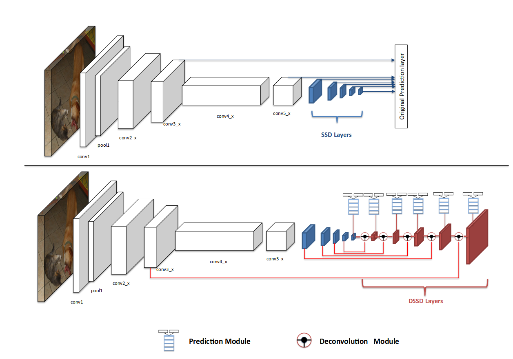
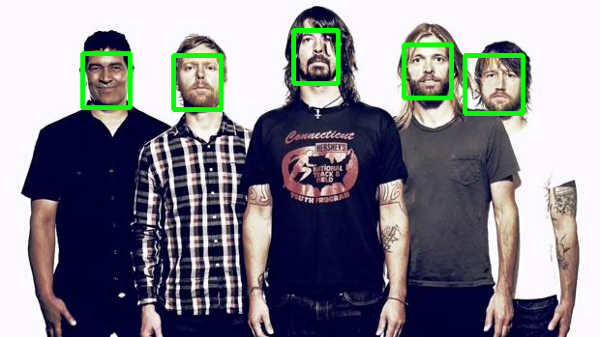
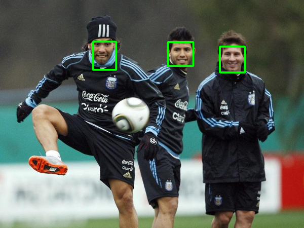
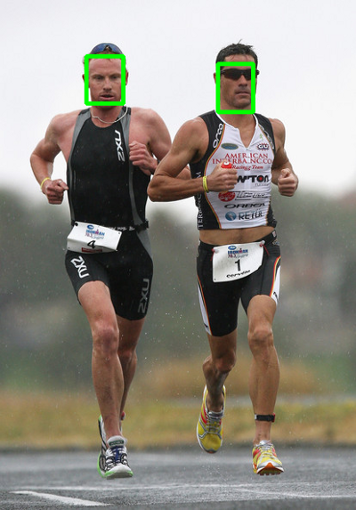

## Face-Detection-SSD
This repository contains the code for face detection using SSD. This repository detect the face from video and cropped the face. The cropped face will save in given folder name.

### Project Structure
```
├── ckpt_	             # Weight used in prediction
├── images               # Images 
├── input-data           # Input data for detection.
├── Readme               # Readme for Face-detection-SSD
├── requiremnts          # Requirements file for Facenet-detection-SSD
```

#### Single Shot Detector - SSD :
Single-shot MultiBox Detector is a one-stage object detection algorithm. This means that, in contrast to two-stage models, SSDs do not need an initial object proposals generation step. This makes it, usually, faster and more efficient than two-stage approaches such as Faster R-CNN, although it sacrifices performance for detection of small objects to gain speed.

#### [RESULTS](result):

##### Architecture of SSD :
Single class object detection models will need less learnable features. Less parameters mean that the network will be smaller. Smaller networks run faster because it requires less computations.




##### Result of face detection SSD :






##### Cropped faces :
	 					

						


#### Research Paper Reference for this repository:

1. [SSD: Single Shot MultiBox Detector](https://arxiv.org/abs/1512.02325)
2. [Blogs links for SSD and images reference](https://towardsdatascience.com/review-ssd-single-shot-detector-object-detection-851a94607d11)
3. [Blogs links for SSD and images reference](https://towardsdatascience.com/faced-cpu-real-time-face-detection-using-deep-learning-1488681c1602)

