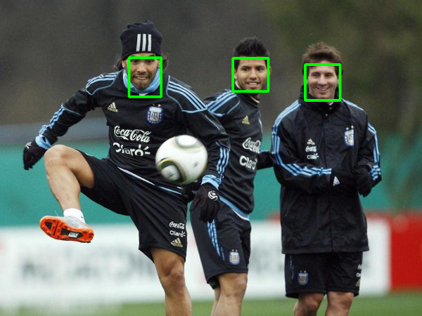
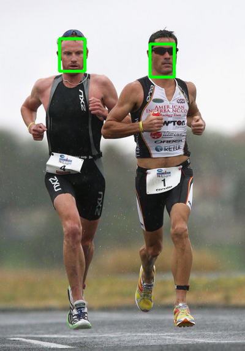

## Face-Detection-SSD
This repository contains the code for face detection using SSD. This repository detect the face from video and cropped the face. The cropped face will save in given folder name.

#### Result of face detection SSD :

#### Cropped faces :
	 					

						

